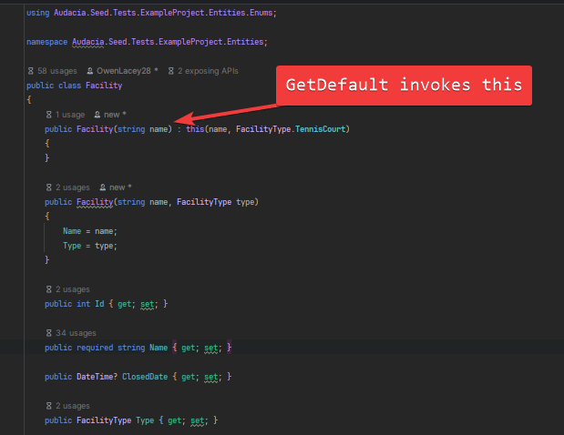
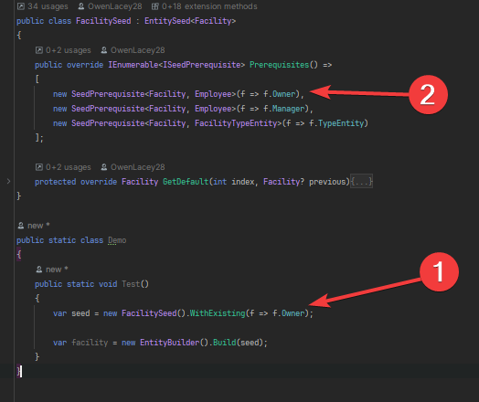
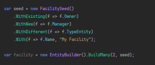
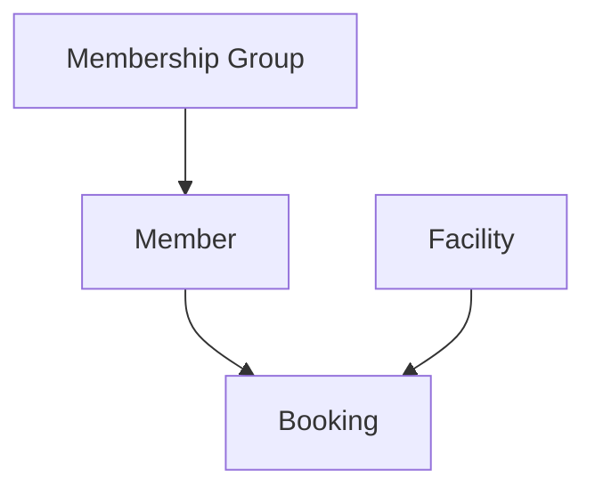

# Contributing

This documentation covers how the seeding process works, so that developers understand how to contribute features or bug fixes to the library.

## Building an entity

To go from a `EntitySeed<T>` to `T` using the `Build`/`BuildMany` methods on `EntitySeed`, there are three main stages to building:
1. Get default
1. Populate prerequisites
1. Apply customisations

Before seeding can take place, the seed must have a `ISeedableRepository` set so it can keep track of the entities it's building for potential re-use. This repository is set based on what you're seeding into, for example there is a `EntityFrameworkCoreSeedableRepository` which is a wrapper around EF Core's `DbContext`, as well as an `InMemorySeedableRepository`, which acts as its own data store.

### Get Default
This calls the overridable `EntitySeed<T>.GetDefault` method, which builds an entity in its simplest form. Unless overridden in a custom seed, this will invoke the simplest contructor for the entity (the one with the least number of parameters):


The values provided to the constructor will be calculated using the `TypeExtensions.ExampleValue` extension method.

### Populate prerequisites
This calls the overridable `EntitySeed<T>.Prerequisites` method to get `IEntitySeed`s for all the navigation properties that need to be set up in order for this entity to be considered valid.

A prerequisite won't be populated if it is overridden with a cusomtisation e.g `WithNew(e => e.Parent)`. This is so that we don't add anything to the `ISeedableRepository` if we're not going to use it.


1. We are specifying a customisation for the `Owner` property, which is specified as a prerequisite.
1. This prerequisite will be ignored when building the entity.

### Apply customisations

A customisation is non-default behaviour that is applied to the entity as the final step of building the entity. All customisations are implementations of `ISeedCustomisation`, and are added using `With...` methods on the `EntitySeed<T>`:


- `WithExisting` => `SeedExistingNavigationPropertyConfiguration`
- `WithNew` => `SeedNavigationPropertyConfiguration`
- `WithDifferent` => `SeedDifferentNavigationPropertyConfiguration`
- `With` => `SeedPropertyConfiguration`


## Seeding order

The seeding order is recursive in that builds the navigation properties (where specified via prerequisites or customisation) for an entity as part of building the entity. 

Consider the following data model:


A "Membership Group" has many "Members", which have many "Bookings", and so on. All the relationships are mandatory.

Let's seed a `Booking`:
```cs
_context.Seed<Booking>();
```
In this scenario, there are no customisations i.e no `With...` usages.

This will do the following:

1. Booking `GetDefault`
1. Booking `PopulatePrerequisites`
    1. Facility `GetDefault`
    1. Facility `PopulatePrerequisites`
    1. Facility `ApplyCusomisations`
    1. Member `GetDefault`
    1. Member `PopulatePrerequisites`
        1. Membership Group `GetDefault`
        1. Membership Group `PopulatePrerequisites`
        1. Membership Group `ApplyCusomisations`
    1. Member `ApplyCusomisations`
1. Booking `ApplyCusomisations`

Let's seed a `Booking` with a customisation for creating a new `Member`:
```cs
_context.Seed(new BookingSeed().WithNew(b => b.Member));
```
Because we've specified a customisation for the member prerequisite, we won't create the member as part of populating the prerequisites. Instead, we'll do it when applying customisations:

1. Booking `GetDefault`
1. Booking `PopulatePrerequisites`
    1. Facility `GetDefault`
    1. Facility `PopulatePrerequisites`
    1. Facility `ApplyCusomisations`
    1. `** SKIP MEMBER **`
1. Booking `ApplyCusomisations`
    1. Member `GetDefault`
    1. Member `PopulatePrerequisites`
        1. Membership Group `GetDefault`
        1. Membership Group `PopulatePrerequisites`
        1. Membership Group `ApplyCusomisations`
    1. Member `ApplyCusomisations`

Though the end result is the same in this example in terms of the data that is seeded, we've changed the order in which the seeding takes place.

This example is using a `SeedNavigationPropertyConfiguration`, which is a `ISeedCustomisation` that is added when you call the `WithNew` method, but this process is true for any implementations of `ISeedCustomistion`. We match a customisation to a prerequisite via the `ISeedCustomisation.MatchToPrerequisite` method.

Let's seed a `Booking` with a customisation for finding an existing `Member`:
```cs
_context.Seed(new BookingSeed().WithExisting(b => b.Member));
```
Here, we don't need to create a new member because we'll chose one that already exists:

1. Booking `GetDefault`
1. Booking `PopulatePrerequisites`
    1. Facility `GetDefault`
    1. Facility `PopulatePrerequisites`
    1. Facility `ApplyCusomisations`
    1. `** SKIP MEMBER **`
1. Booking `ApplyCusomisations`
    1. Set `booking.Member` to existing Member 

## Change Tracking

> [!NOTE]
> This applies to EF Core only.

As per [ADR0001](./docs/adr/0001-clear-the-ef-core-change-tracker.md), the change-tracker is cleared at the beginning and end of seeding e.g a single call to `Seed` or `SeedMany`.

If this weren't the case, the following bad things would happen:
- The `ISeedableRepository.FindLocal` method would return entities that had already been pulled out of the database, meaning that `WithNew` would return entities that haven't been built during seeding.
- The test target wouldn't flag any missing `Include`s for any entities that are already loaded into memory.


## Caching

When seeding an entity, it's perfectly feasible to repeatedly look up the same information. We cache the following pieces of information for performance reasons:
- Model information for an entity, such as it's required navigation properties and primary key.
- The `EntitySeed<T>` for `T` that was found using reflection.